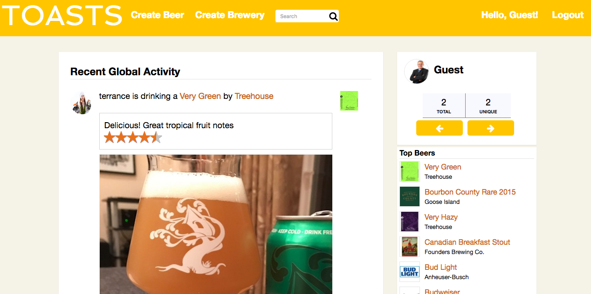
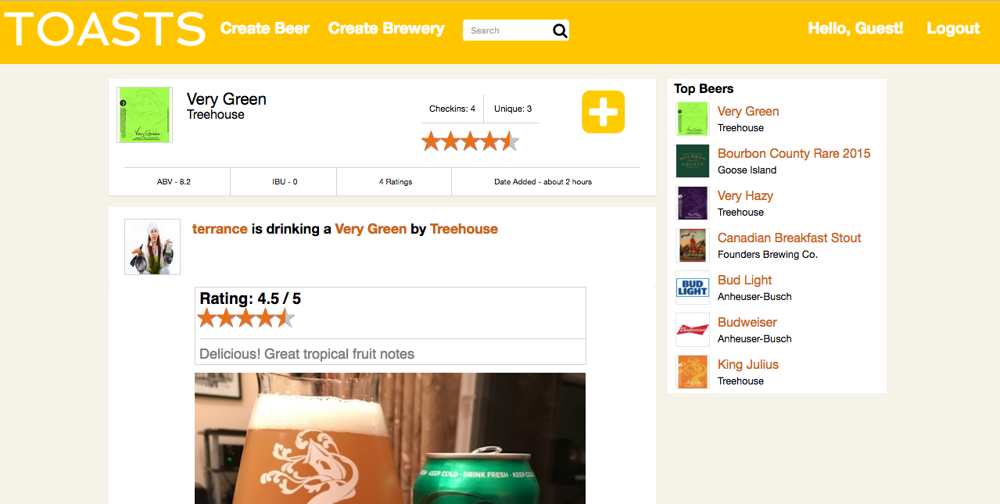
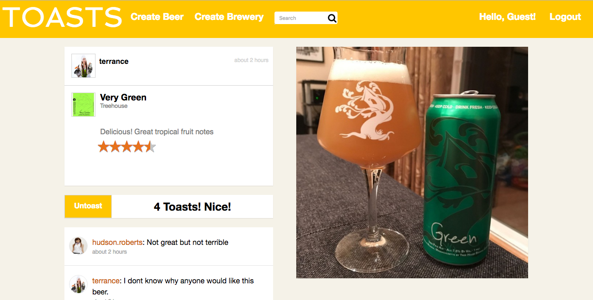

#Toasts

[Toasts live](https://untapped-clone.herokuapp.com/)

##Technologies used

* Ruby
* Rails
* Javascript
* React
* Redux
* PostgreSQL
* Amazon Web Services
* Gems/supplemental
  * paperclip
  * Bcrypt
  * figaro
  * jbuilder

## Features

* Session authentication on backend
* Creation of beers and breweries.
* Checkin to beers
  * Provide rating and short review
* Like and comment on users checkins
* See all checkins associated with a particular beer / brewery as well as average score

To view the code behind Toasts in more detail, please visit the following folders:

[Models](app/models)
[Controllers](app/controllers)

## Major Components

###Beers

Beers are stored in a database table called beers with columns id, style, ABV, IBU, brewery_id and name. An API call is made whenever a beer show page is accessed that will retrieve all information for that beer. This beer object will be held in the state of the front end until a new beer is requested. A beer belongs_to a brewery and also has_many checkins.

On the front end, beer is rendered in the BeerShow component.

Beer show will also load all checkins associated with that beer.

###Brewery

Breweries follow a pattern similar to beers. They exist in a brewery table with the columns name, city, state, and country. A brewery has a has_many association with beers. There is also a has_many_through association with checkins through beers.

On the front end, when a beer show page is accessed an API call will be made that will retrieve that brewery object. This object will persist in the state until a new beer is requested. A brewery will be rendered in the BreweryShow container.

Brewery show page will also load all checkins associated with that brewery.

###Checkins

A checkin is an event created by a user in which they can publicly post that they are drinking a certain beer, as well as give it rating and optional description. A checkin will be stored in the checkins table which will have the columns user_id, beer_id, rating, and description.

When an individual checkin is accessed, it will be rendered through the CheckinShow component. This checkin will be stored in state until a new checkin is accessed.

## Site layout

Upon sign-in, the user will be directed to a home page which lists recent checkins for all users globally. When friends are implemented, this page will be replaced by activity limited to only friends.

The user can also see more specific checkins by visiting a beer or brewery show page. These pages will contain checkins specific only that item. These can either be accessed by clicking a link found in a checkin, the list of top beers or the search feature.

Users can checkin to a beer by visiting the show page and clicking the checkin button. The user can provide a rating as well as a short description of the beer to let other users know what they think.

Users can visit a show page for each individual checkin to leave likes and comments.

##Features to be implemented

###Friends

I plan to implement friends with a join table on the back end with the columns requested_id, requester_id, accepted. The front end will have access to the id of each of the current users friends in order to determine wether or not another user can be requested or if certain actions are forbidden.
